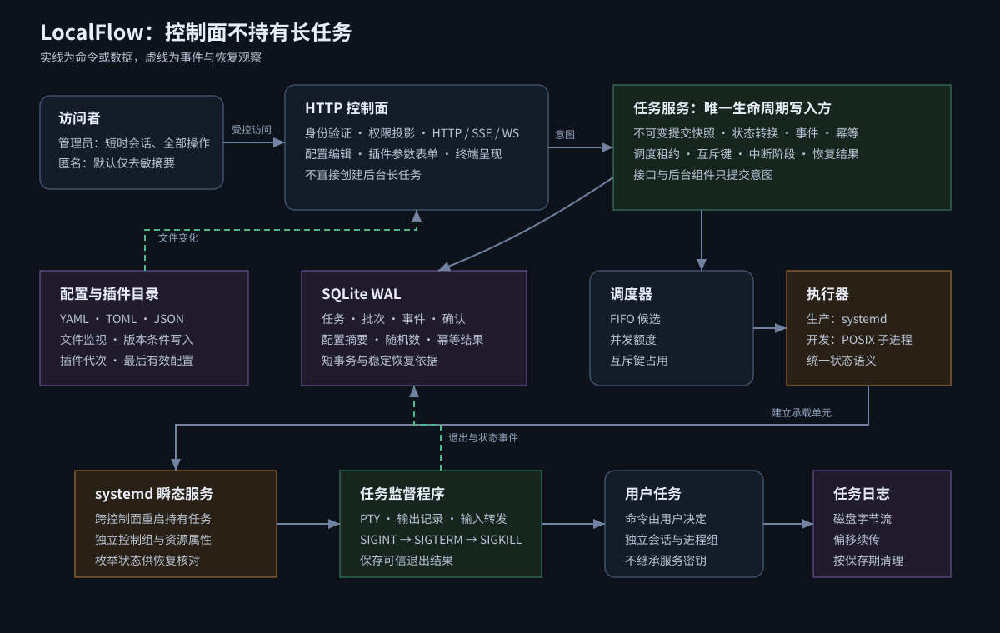

# LocalFlow 系统设计



## 设计结论

系统采用单机控制面、独立任务承载面。网页服务负责验证请求、读写配置和呈现状态，任务进程由 systemd 瞬态服务持有。网页服务重启不会把任务带走，恢复程序可从数据库和 systemd 两侧重新建立观察关系。

任务生命周期只有一个写入入口。接口、调度器、恢复程序和中断处理都向任务服务提出意图，任务服务在短事务中更新状态并追加事件。该约束避免多个后台循环相互覆盖状态。

## 运行根目录

```text
localflow-root/
├── config/          # YAML、TOML、JSON 设置与任务配置
├── scripts/         # 配置引用的本机脚本与工具
├── plugins/         # 本地 Python 插件
├── runtime/
│   ├── localflow.db # 任务、事件、确认与幂等记录
│   ├── port         # 当前监听地址和端口，权限 0600
│   └── instances/   # 任务监督程序的运行描述
├── logs/service/    # 可轮转的服务摘要与 debug 日志
├── logs/<task-id>/  # 有硬上限的任务输出与终端记录
├── secrets/         # 程序密钥与管理员引导文件
└── exports/         # 用户明确导出的文件
```

配置、插件和密钥由用户或管理员维护；`runtime` 与 `logs` 只由服务身份写入。所有可恢复状态都在根目录内，不依赖当前 shell 的工作目录。

## 任务状态

```text
queued -> starting -> running -> succeeded
   |          |          |   -> failed
   |          |          |   -> cancelled
   |          |          |   -> lost
   |          |          -> cancelled
   |          -> queued
   -> cancelled
```

`starting` 表示已取得队列位置、正在创建承载单元；创建失败进入 `failed` 并记录 `task.start_error`。`lost` 表示恢复时没有可信的运行方或退出结果。终态不重新进入运行态。

## 调度规则

每个任务保存显示标签与互斥键。调度器按创建序列寻找可运行任务，只有并发额度可用且任务的所有互斥键都未被运行任务占用时才启动。取得键、切换 `starting` 和记录事件在同一数据库事务完成。

批量请求先由模板提供者展开成独立任务草稿，再一次写入批次和任务记录。验证仿真的每个 case、每次运行均有自己的任务 ID、seed、日志和退出状态。

## 进程所有权与中断

生产环境为每个任务创建一个 systemd 瞬态服务。服务内启动轻量监督程序，由监督程序分配伪终端、记录输出、转发输入并保存退出结果。systemd 负责跨网页服务重启的进程所有权；监督程序负责终端语义。

停止是任务快照中的有界动作序列：可向整个任务 control group 发 `SIGINT`/`SIGTERM`，向 PTY 写程序约定的输入，或执行程序提供的停止 CLI；动作可等待自己开始之后的新输出。未声明策略时使用 SIGINT、SIGTERM、SIGKILL 三级默认值。重复点击同一停止按钮只跳过当前等待，不并行启动第二套序列。控制服务重启后从记录的动作恢复，因而插件必须把停止动作设计为可重放。

人工终端控制与停止状态机彼此独立。终端页发送的 Ctrl+C 是 PTY 字节 `0x03`，程序可以进入命令模式后再 `resume`，不会因此被核心标为取消。停止动作全部耗尽后仍存活，核心对 systemd 单元的整个 control group 发送 SIGKILL；监督程序写出退出结果且单元变为 inactive 后，任务才进入终态。由此避免主进程退出但后台子进程残留。

开发执行器直接创建新会话与进程组，用于 Windows 开发和 Linux 自动测试。它不能作为 Ubuntu 生产部署已验证的替代品。

## 数据与实时通道

SQLite 保存任务快照、事件、确认状态、幂等结果和批次。WAL 允许读取与短写事务并行，主库与 WAL 均有配置上限。日志正文按任务及时追加，数据库保存最终大小，详情接口根据固定根目录计算日志位置。服务摘要和 debug 分轨轮转；任务输出同时受单任务上限、总量上限和最小空闲空间保护。

任务状态使用服务器发送事件广播，并带单调递增事件序号供重连续传。交互终端使用 WebSocket；只读角色只能接收输出，管理员才可发送输入和调整尺寸，非法输入返回 `error` 消息。

## 配置更新

配置文件是原始数据。文件监视器读取变化、解析并校验，成功后发布内容哈希；失败时发布诊断且不会改变已加载的进程级设置。网页保存必须携带所见版本，服务器将内容写入同目录临时文件，完成同步、校验和原子替换。任务配置每次展开重读文件；`server.yaml` 的进程级设置在重启后生效。

配置加载先检查 `!include` 图不越出 `config/`，再由 `python-library-configlib` 合并。零公共任务字段保持普通配置；任一公共字段触发公共结构诊断；顶层 `plugin` 再触发插件存在性、必填字段和专属模型诊断。变量按全局、项目、任务配置、本次运行合并。插件在任务建立前完成参数校验和展开；配置资源树自动发现固定目录，不要求用户扫描。可运行文件默认直接显示插件运行参数，需要修改稳定配置时才进入编辑器。解析后的命令、目录、seed、case、插件状态合同和计算字段写入不可变任务快照。

## 插件隔离

插件扫描器为每次加载创建新代次。注册表只接受声明完整且名称唯一的模板提供者。加载失败保留诊断；如果本轮没有任何可用插件则保留上一代，否则发布本轮成功装载的集合。任务快照记录插件标识、版本摘要和代次，因此文件修改只影响新提交。

当前隔离边界是 Python 模块与错误边界，不是安全沙箱。插件与服务身份具有相同文件权限，只能安装受信任插件。

## 访问边界

默认监听回环地址并由操作系统选择端口，但回环连接不代表当前 Unix 用户。匿名访问默认只能读取去敏摘要，所有改变状态的动作都要求管理员会话。程序调用使用磁盘密钥生成的请求签名；浏览器通过一次性本地引导流程取得短时会话，不接触长期程序密钥。

摘要投影在服务端生成，不能依靠前端隐藏字段。SSE 与 WebSocket 使用同一权限判定。监听非回环地址时必须启用 TLS，并只信任明确配置的代理头。

直接来自回环地址的网页按当前产品合同自动建立短时管理员会话；非回环网页按匿名策略投影为只读。`localflow open --root <目录>` 仍可读取权限为 `0600` 的管理员引导文件，把短码放入 URL fragment，并在网页加载后交换为 `HttpOnly` 会话后立即清除 fragment，供受控代理等非回环入口使用。回环 TCP 无法区分同机 Unix 用户，因此严格多用户部署必须使用系统级网络/会话隔离；长期程序 API key 与浏览器流程完全分离。

默认 FastAPI `/docs`、`/redoc` 和 `/openapi.json` 均关闭。管理员页面从受会话保护的 `/api/v1/openapi` 读取与当前程序同步的 schema，按操作折叠显示；匿名身份既看不到页面入口也不能读取 schema。

## 时间处理

持续时间和超时基于单调时钟。墙钟只用于对外时间戳，校准前后均记录审计事件。修改系统时间通过只允许特定动作的辅助程序完成，网页服务不以 root 运行。

## 恢复次序

启动时先打开数据库并校验结构，再载入最后有效配置和插件代次，随后枚举未结束任务及其 systemd 单元。仍运行的任务恢复观察；已有退出结果的任务完成终态；无法证明状态的任务进入 `lost`。完成恢复后才启动调度器和对外写接口。

## 选择与取舍

- 使用 systemd 瞬态服务而非把长任务放进网页进程，因为任务寿命必须独立于网页服务。
- 使用 SQLite WAL 而非外部消息代理，因为目标是离线单机，且需要最少运维依赖。
- 使用服务器发送事件传递状态、WebSocket 传递终端，因为状态是单向事件流，终端需要双向低延迟通道。
- 使用独立互斥键而非让标签直接控制串行，因为标签主要用于检索，复用同一字段容易产生隐式阻塞。
- 使用文件为配置原始数据而非数据库镜像，因为用户要求本地编辑与网页编辑具有同等地位。

## 已知边界

真实 systemd、POSIX 权限、PTY 信号和服务重启接管已经在 Ubuntu 24.04/systemd 255 容器中验证，证据见质量报告；实际服务器发行版升级后仍应复跑同一门禁。插件不是不受信任代码的安全沙箱。网页已在系统 Edge 中通过独立 Playwright 视觉、键盘、权限、终端、编辑器和窄屏门禁；Codex 内置浏览器桥接受管理员 Hook 限制，不影响项目自带的验收入口。
